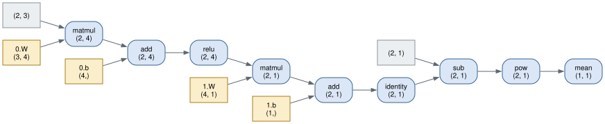

# PyNN — Design Notes

Why the library is built the way it is, what the hard parts were, and what was left out
on purpose. Written for someone reading the code for the first time — or asking about it
in an interview.

---

## 1. Define-by-run, not a static graph

There are two ways to get gradients out of a numerical program. A **static graph** asks
you to describe the computation first (TensorFlow 1, Theano), compiles it, and then runs
it with data. A **define-by-run** tape (PyTorch, autograd, JAX's `grad` on traced
functions) records the operations as they actually execute, so the graph is a byproduct
of the forward pass.

PyNN is define-by-run, for one reason that matters more than the rest: **the graph is
ordinary Python control flow**. A conditional, a loop whose trip count depends on the
data, an early exit — all of them work without a special-cased operator, because the
tape only ever records what really ran. Lazy shape inference (`Linear(16)`, below) falls
out of the same property: the layer can wait until it sees a real input because there is
no separate compile step that needs the shape earlier.

The cost is that there is no whole-graph view to optimize. There is no operator fusion,
no dead-node elimination, no memory planning. Every operation allocates its output and
its closure. That trade is visible in the benchmarks: PyNN is within about 2x of PyTorch
on a matmul-dominated MLP, where BLAS does the work for both, and roughly an order of
magnitude off on a CNN, where PyTorch fuses convolution kernels across threads and PyNN
does not.

## 2. The tape is closures, not an operator registry

Most autodiff libraries define an `Op` class hierarchy: each operation is a class with a
`forward` and a `backward` method, and the graph is a list of `Op` instances with their
saved inputs. PyNN instead records, on each output `Tensor`:

- `children` — the tensors it was computed from, and
- `reverse` — a **closure** that pushes this tensor's gradient into those children.

An operation is therefore just a function:

```python
def tanh(x: Tensor) -> Tensor:
    array = x.data
    data = np.tanh(array)
    output = Tensor(data)
    output.add_children((x,))

    def reverse():
        x.grad += (1 - data**2) * output.grad

    output.forward = "tanh"
    output.reverse = reverse
    return output
```

The closure captures exactly the intermediates the backward pass needs — here `data`,
the forward result, because `d/dx tanh(x) = 1 - tanh(x)²`. Nothing has to be explicitly
declared as "saved for backward"; Python's closure capture *is* the save list. The whole
of `pynn/functional/activations.py` is nine functions in this shape, and a new operation
is one function rather than a class plus a registration.

What it costs: no operator metadata to introspect, no way to serialize a graph, and one
Python closure object allocated per operation. For a library whose point is to be
readable, that is the right side of the trade.

### What the tape looks like

Because the graph is a byproduct of the forward pass rather than something declared
ahead of it, it can be read back off the tensors themselves. That is all `pynn/viz.py`
does: walk `children` from an output, label each node with its `forward` string and its
shape, emit Graphviz DOT.



Fifteen nodes — `Sequential([Linear(3, 4, activation="relu"), Linear(4, 1)])` on a batch
of two, and a squared-error loss. Every one of them is a `Tensor`: the parameters, the
input batch, the targets, and every intermediate. There is no operator object standing
beside them, which is what "closures, not an operator registry" amounts to in practice —
the nodes are the values, and the operation survives only as a name and a closure.

The `identity` node is the second layer's default activation. It is there because it
really ran, which is the define-by-run bargain in one node: the graph records what
happened rather than what was declared, so a no-op costs a node and a data-dependent
branch costs nothing.

### `grad +=`, never `grad =`

The single most important line in the file above is `x.grad += ...`.

A tensor consumed by more than one downstream operation receives one gradient
contribution per consumer, and they must be **summed**. Assigning keeps only the last
one. The reason this bug survives for a long time is that it is invisible in a plain
feedforward network: an unbranched chain gives every tensor exactly one consumer, so
overwriting and accumulating agree exactly. It surfaces the moment there is a residual
connection, a tied weight, an auxiliary loss, or a regularization term — which is to say,
the moment the model gets interesting.

This is why `pynn.verify` checks **every unary and binary operation twice**: once alone,
and once with its input also feeding a second consumer. The single-consumer form is
exactly correct either way and proves nothing.

## 3. Backward: an iterative topological sort

`Tensor.backward()` does three things.

**It refuses an ambiguous seed.** The gradient of a non-scalar output is not defined
without saying *of what*. Seeding all-ones silently differentiates `sum(output)` instead,
which is a different function than the caller asked for. So a non-scalar output requires
an explicit `gradient=`.

**It orders the graph iteratively.** The reverse pass has to visit a node only after
every consumer of it has run, which is a reverse topological order. The natural
implementation is a recursive depth-first search, and it blows the Python stack at a few
thousand nodes — an unrolled recurrence or a long residual stack reaches that easily. So
the traversal keeps an explicit stack of `(tensor, next-child-index)` frames:

```python
stack = [(self, 0)]
while stack:
    tensor, child_index = stack.pop()
    if child_index < len(tensor.children):
        stack.append((tensor, child_index + 1))     # resume here later
        child = tensor.children[child_index]
        if child not in visited:
            visited.add(child)
            stack.append((child, 0))
    else:
        order.append(tensor)                        # all children done
```

A 5000-node chain is a check in the shipped verification suite.

**It accumulates rather than resets.** `backward()` adds into whatever gradients are
already there and never zeroes them, so gradient accumulation over micro-batches is just
calling it twice. The corollary is that a training loop *must* call `zero_grad()`
between steps.

Read "twice" precisely: *two forward passes over the same leaves*, each building its own
graph. Calling `backward` twice on **one** graph is a different thing and this library
gets it wrong — every Tensor keeps a `grad`, intermediates included, and every reverse
closure reads its output's stored gradient, so the second pass finds the first pass's
values still on every intermediate and propagates them again. It compounds rather than
doubling, and the overshoot grows with depth. PyTorch avoids this by storing gradients
on leaves only and passing intermediates transiently; `TASKS.md` item 4 has the
measurements and the three ways out. `free_graph` makes it unreachable on any graph the
caller frees, which is the practical answer until one of those is taken.

What it does *not* do is release the graph afterwards. That is `free_graph`, and §8 is
about why it is a separate call.

## 4. Broadcasting, backwards

Broadcasting is where from-scratch autodiff projects usually stop being correct, and it
is worth being precise about why.

When NumPy broadcasts an operand, it implicitly **copies** that operand along the
broadcast axes. `X @ W + b` with `b` of shape `(out,)` and a batch of 32 is really `b`
copied 32 times. The derivative of a copy is a sum, so the reverse pass must sum the
incoming gradient over exactly the axes that were broadcast — otherwise the bias
gradient is 32 times too small, and training still works, just worse.

`pynn/core/utils.py::unbroadcast` does this in two steps, mirroring NumPy's two
broadcasting rules:

1. Sum away the leading axes the operand never had (`(4, 3)` gradient → `(3,)` operand).
2. Sum, keeping dimensions, the axes where the operand had length 1
   (`(4, 3)` gradient → `(1, 3)` operand).

The subtle part is *what* gets reduced. The original implementation expanded the
operand's **already accumulated** `.grad` up to the broadcast shape, added, and summed
back down — which multiplies every previously accumulated value by the broadcast factor.
Two backward passes before a step gave `[4, 4]` and then `[20, 20]` instead of `[8, 8]`.
The rule is: **reduce the incoming gradient, then add.** Never touch what is already
there.

`matmul` needs its own version, because `np.matmul` is not a plain elementwise
broadcast: a 1-D operand is promoted to a matrix for the multiply and the promoted axis
is then dropped from the result, while leading axes broadcast normally.
`matrix_multiply_gradients` promotes both operands to at least 2-D, applies the matrix
rule over the last two axes, and then undoes each adjustment in the right way — a
promoted axis is *squeezed* (it was never real), a broadcast batch axis is *summed*.

## 5. Why softmax and cross-entropy are fused

Composing a `Softmax` layer with a cross-entropy loss is the obvious design and it is
wrong in a way that is easy to miss.

For `L = -Σ y·log(softmax(z)) / B`, the famous gradient is

```
dL/dz = (softmax(z) - y) / B
```

That expression is the gradient **with respect to the logits `z`** — it already has the
softmax Jacobian folded into it. If the loss writes it onto a separate softmax node's
output, that node's own `reverse` then applies the softmax Jacobian a *second* time to a
quantity that has already been through it. The result is off by roughly 3x in magnitude
and, for some entries, has the wrong sign. Training still descends, because the wrong
gradient is positively correlated with the right one — the original MNIST example reached
94% instead of the 98% it reaches now.

So `categorical_crossentropy(..., logits=True)` computes the softmax internally, takes
the gradient with respect to the logits directly, and records only the logits tensor as
its child. The `logits=False` branch is a genuinely different function and gets the
genuinely different gradient, `-y / (p·B)`.

Fusing buys numerical stability too. `binary_crossentropy` from logits uses

```
max(z, 0) - z·y + log1p(exp(-|z|))
```

which is algebraically `-[y·log σ(z) + (1-y)·log(1-σ(z))]` but never evaluates `log(0)`
and never overflows `exp`.

The same reasoning drives the fused reverse passes in `layer_norm` and `batch_norm`. The
mean and the variance depend on *every* element being normalized, so the naive composed
graph re-derives that dependency once per element. Writing the reverse out by hand —

```
dx = (dx̂ - mean(dx̂) - x̂ · mean(dx̂ · x̂)) / std
```

— is one pass over the data instead of N.

Note that `softmax` itself, used standalone, keeps the **full Jacobian-vector product**
rather than assuming a cross-entropy downstream. It is a general-purpose operation, and
it is correct for any axis and any consumer.

## 6. The Module tree

`Module` is the only container abstraction. It owns two things:

- `parameters` — a `dict[str, Tensor]` of its **own** parameters,
- `_modules` — a `dict[str, Module]` of its children, populated automatically when a
  `Module` is assigned to an attribute.

Every collective operation is a recursive walk of that tree: `named_parameters`,
`parameter_groups`, `named_buffers`, `state_dict`, `zero_grad`, `train`/`eval`,
`freeze`/`unfreeze`, `num_parameters`.

The auto-registration is a small `__setattr__` override. It matters because the
alternative failure mode is silent:

```python
class Block(Module):
    def __init__(self, width):
        super().__init__()
        self.first = Linear(width, activation="relu")   # registered here
        self.second = Linear(width)
```

Without it, `Block`'s layers would run in the forward pass, receive gradients, and never
be handed to an optimizer — a model that trains its last layer and nothing else, with no
error anywhere.

### Containers, and the assignment that used to fail quietly

Auto-registration keys on `isinstance(value, Module)`, which leaves one hole: a plain
list.

```python
self.blocks = [Linear(64), Linear(64)]     # not a Module — not registered
```

Those layers run in the forward pass and receive gradients. They are simply absent from
`named_parameters`, so no optimizer ever steps them and no checkpoint ever saves them.
The model trains, the loss falls — the layers that *are* registered take up the slack —
and the ones in the list sit at their initial weights forever. PyTorch has the same hole
and answers it with `ModuleList`; a user who forgets gets no warning.

`ModuleList` and `ModuleDict` are the containers. They register their contents, so
everything recursive reaches them:

```python
self.blocks = ModuleList(Linear(64, activation="relu") for _ in range(depth))
# -> blocks.0.W, blocks.0.b, blocks.1.W, ...
```

Neither has a `forward`: the point is to hold modules whose wiring the enclosing module
decides, and `Sequential` already covers "apply these in order". Calling one raises
rather than guessing.

The second half is the part PyTorch does not do. `Module.__setattr__` **refuses** a
plain list, tuple, or dict that contains a `Module`, naming the wrapper to use. An
assignment that would have silently cost you a layer is now a `TypeError` at the moment
you write it. That trade — a false positive is a one-line fix, a false negative is a
model that never trains a third of itself — is the same one the rest of this library
makes everywhere.

Indices in a `ModuleList` are positions, so inserting renumbers the paths after it and
a checkpoint taken before the insert will not load after one. `ModuleDict` keys become
path segments, so a key containing `.` is refused for the same reason.

### Why `Sequential` had to become a `Module`

`Sequential` used to subclass a separate `Model` base whose `parameters` was a
`list[dict]`, while `Module.parameters` was a `dict`. Nesting one inside another
type-checked, ran the forward pass correctly, and then died inside the optimizer with
`AttributeError: 'list' object has no attribute 'items'`.

Collapsing the two hierarchies into one is the structural change everything else depends
on. `Dropout`, the normalization layers, `state_dict`, `train`/`eval` and per-branch
freezing are all one-liners *given* a tree that composes, and are all special cases
without one. `Model` no longer had anything to do and was deleted rather than left
behind as a base class nothing implements.

### Parameter groups, and why they are live

An optimizer takes the model:

```python
optimizer = SGD(model, learning_rate=0.01)
```

and normalizes it to `model.parameter_groups()` — one group per module in the tree,
holding **the modules' live dictionaries, not copies**. That is deliberate. Layers build
their parameters lazily on the first forward pass, so an optimizer constructed the usual
way (before training starts) is looking at dictionaries that are still empty. Because the
references are live, the parameters simply appear.

Modules with no parameters contribute an empty group. That keeps the list index-aligned
with each optimizer's per-group state as those dictionaries fill in.

Passing the old `model.parameters` — now a plain dict — raises a `TypeError` naming the
fix, rather than iterating a dict's keys and silently stepping nothing.

### Two flags, deliberately

`Tensor` carries both `requires_grad` and `trainable`, and they are not the same thing:

| Flag | Means | Set by |
| --- | --- | --- |
| `requires_grad` | connected to the graph; `backward` can reach it | `no_grad`, `detach` |
| `trainable` | an optimizer may step it | `Module.freeze()` |

A frozen parameter still *receives* a gradient during the backward pass — freezing is not
detaching. It is `Optimizer.trainable_parameters()` that filters it out of the update.
Keeping these separate is what lets you freeze a pretrained trunk while gradients still
flow *through* it to layers below.

### Buffers

Batch normalization's running mean and variance belong to the module but must never be
stepped by an optimizer. They live in `_buffers`, are excluded from `parameter_groups`,
and are included in `state_dict` — because a batch-normalized model that loses its
running statistics evaluates differently after a checkpoint round trip. The weights alone
are not the whole model.

## 7. Training and evaluation modes

`Dropout` is the canonical reason a model needs modes: at training time it zeros a
random fraction of its input; at evaluation it must be exactly the identity. `BatchNorm`
is the other: it normalizes by the current batch's statistics while training and by
running estimates afterwards, so that inference on a single example is well-defined at
all.

`model.eval()` walks the tree and sets `training = False` on every module; `model.train()`
sets it back. Both return `self`, so they chain. A branch can be switched on its own
(`model[0].eval()`), which is what fine-tuning with a frozen, batch-normalized trunk
needs.

**Inverted dropout** is what makes the eval path free: the surviving activations are
divided by the keep probability during training, so the expected value already matches
the input and evaluation needs no compensating factor.

## 8. Turning the tape off

Inference does not need a graph. Building one is wasted work per batch, and it is worse
than waste when the outputs are kept: every `reverse` closure holds the forward pass's
intermediate arrays, so a validation loop that collects predictions retains the entire
graph of every batch it has seen.

```python
model.eval()
with no_grad():
    predictions = [model(Tensor(batch)) for batch in batches]
```

The implementation deliberately has exactly **two gates**, both inside `Tensor`, so that
no operation has to check the mode itself:

- `add_children` drops the edges and marks the output as not requiring gradients;
- the `reverse` **setter** discards the closure instead of storing it.

The second is the one that actually frees memory, and it is why `reverse` is a property
rather than a plain attribute. The alternative — an explicit `record(forward, children,
reverse)` method called by every operation — is arguably cleaner, and would mean touching
all ~25 operation sites; the property keeps the gate in one place.

`backward()` on a tensor produced under `no_grad`, or on one that has been `detach`ed,
raises rather than quietly returning zeros.

### Giving the tape back

`no_grad` is how a tape is never built. The other half of the problem is a tape that
*was* built, has been differentiated, and is now dead weight.

Going out of scope does not free it. Every Tensor's `reverse` is a closure that
references the Tensor it belongs to, so a finished graph is a **reference cycle** and
dropping the last name pointing at a loss frees nothing. Only the cyclic collector can,
and CPython schedules a full collection from how much the *object count* has grown — a
number with no relation to the hundreds of megabytes of NumPy arrays hanging off those
objects. A feedforward graph is a few dozen nodes and nobody ever notices. A 64-step
unrolled LSTM at batch 32 is about 150 MB per step, and over 400 steps the difference is
242 ms/step peaking at 3,813 MB against 81 ms/step peaking at 860 MB.

The **speed** column is the surprising one, since a garbage-collection pause in a
training loop is supposed to cost rather than pay. Allocating against a heap that is
mostly garbage is more expensive than not having the garbage — three times more, here.
And it only appears at scale: the same benchmark over 60 steps reports the uncollected
run as the fast one, which is exactly the length of benchmark somebody writes to check.

`Tensor.free_graph()` clears each node's `children` and `reverse` over the order
`backward` walks. That breaks every cycle, so reference counting reclaims the graph as
the call returns and no collection happens at all. `data` and `grad` are untouched, so
the parameters still carry the gradients the optimizer is about to read, and the loss is
still a number you can print.

**Why a method rather than a default.** PyTorch spells this `backward(retain_graph=False)`
and frees as the reverse pass goes, which is cheaper — no second traversal — and is the
right default for a library whose users already expect it. It is also a behaviour change:
re-running one graph is something a caller may reasonably expect to work, and every
caller who does would break at once. An explicit `free_graph()` changes nothing that
works today and costs one extra topological sort — 0.85 ms against a 79 ms step on the
model above, about 1%. It can still *become* the default later, once there is evidence
that nobody depends on the old behaviour. The reverse move, shipping the default and
walking it back, is the one that cannot be made quietly.

**And it has to fail loudly.** A freed node still has a `reverse` — the one that does
nothing — so a second `backward` would walk the stump, find no children, and report
zeros. That is not a crash; it is a converged model. `backward` therefore scans the
order for a freed node before accumulating anything and raises if it finds one, which
costs 0.03 ms on the graph above. Scanning the whole order rather than only the tensor
it was called on catches the subtler case too: freeing one loss poisons any tensor it
shared with a graph still in use, and the error says so rather than letting the second
loss train on nothing.

## 9. Numerical stability

Four places where the obvious formula is wrong at the edges:

| Function | Naive form | Problem | Used instead |
| --- | --- | --- | --- |
| `sigmoid` | `1 / (1 + exp(-x))` | overflows for large negative `x` | branch on the sign, `pynn/core/numeric.py` |
| `softplus` | `log(1 + exp(x))` | `softplus(800)` → `inf` | `np.logaddexp(0, x)` |
| `log` | `log(x + EPSILON)` | `EPSILON ≈ 2.2e-16` is far too small to tame `log(0)`, and it biases the result everywhere | clamp the input |
| `elu` / `selu` | `alpha * (exp(x) - 1)` | catastrophic cancellation near 0 | `np.expm1` on a clamped input |
| `softmax` | `exp(x) / sum(exp(x))` | overflows | subtract the row max first |

`pynn.verify.check_stability` asserts every activation and loss stays finite at `|x|` up
to 1000, with NumPy floating-point warnings promoted to errors so a silent overflow fails
the check rather than printing a warning nobody reads.

## 10. Convolution: im2col and one matmul

The first implementation was a Python double loop over output positions. The current one
unrolls every input patch into a row of a matrix and does a single `gemm`:

```
cols  : (N·out_h·out_w, in_ch·kh·kw)      one row per output position
kernel: (in_ch·kh·kw, out_ch)
                    ↓
out   : (N·out_h·out_w, out_ch)   →   (N, out_ch, out_h, out_w)
```

`im2col` builds `cols` as a **strided view** (`np.lib.stride_tricks.as_strided`) rather
than a Python loop, so the only work that scales with output size is the matmul itself.
It is then made contiguous, deliberately: the view aliases the input, and the reverse
pass reads it after the forward pass has returned.

The reverse pass is two matrix products and a scatter:

- `dK = dOutᵀ @ cols`
- `dX = col2im(dOut @ Kᵀ)`

`col2im` is the adjoint of `im2col`: it scatters rows back into the image, **adding**
where windows overlapped, because a pixel read by several windows contributes to several
outputs. The test for it is the adjoint identity `⟨im2col(x), c⟩ == ⟨x, col2im(c)⟩`,
which is exactly the statement that one is the reverse-mode of the other.

The pooling layers reuse the same machinery, folding channels into the batch axis so that
each row of `cols` is one window of one channel. Max pooling's reverse scatters each
output's gradient to the single position that won its window; average pooling spreads it
evenly. Max pooling pads with `-inf` rather than zero, or a zero pad would beat every
negative input.

## 11. Verification, not just tests

`pynn/verify/` is a shipped subpackage, not a test helper. It runs against an installed
copy of PyNN without pytest (`python -m pynn.verify`), and `tests/` drives it as well so
it cannot rot.

The reason it exists separately: **an autodiff library can be wrong while looking
healthy.** Training loss falls when a gradient is scaled by the batch size. A momentum
buffer with a dropped gradient term still descends, just more slowly. An activation that
overflows to `inf` only poisons a run once the inputs grow large enough. None of these
fail a shape test, and none of them fail a "did the loss go down" test.

Three suites:

- **`check_all_gradients`** — 226 checks. Every operator across broadcasting shape
  combinations, every activation at normal *and* overflow-scale magnitudes, every loss in
  both its logits and probability forms, every module function across strides and
  paddings, and eight graph topologies where a tensor has more than one consumer. Central
  differences, `(f(x+h) - f(x-h)) / 2h`, on float64, with relative error scaled by the sum
  of magnitudes so the check stays meaningful for near-zero gradients.
- **`check_stability`** — finiteness far past where `exp` overflows.
- **`check_invariants`** — behavioral properties of the tape, the module tree, the
  optimizers, and the public factories. Each optimizer is compared against a **closed-form
  transcription of its published update rule**, not against "the loss went down".

The suite was mutation-tested to confirm it is not vacuously green: reintroducing each of
the original bug classes produces failures (reverting accumulation in `core/math.py` → 16
failures; in `functional/activations.py` → 12; removing `unbroadcast` → 39; breaking the
SGD momentum term → 3; restoring the naive sigmoid → 2).

`check_gradients` is public API, so users can verify their own layers:

```python
result = check_gradients(lambda ts: my_loss(ts[0]), [Tensor(x)])
assert result.passed, result
```

## 12. Fan-in is a property of the layout, not of `shape[0]`

The scale a variance-scaling initializer picks is a function of how many inputs and
outputs a weight connects. `he_normal` originally computed it as `sqrt(2 / shape[0])`,
which is fan-in only for a 2-D `(in_features, out_features)` matrix. A `Conv2d` kernel is
shaped `(out_channels, in_channels, kh, kw)`, so that reads the *output* channel count
and drops the receptive field entirely: `Conv2d(16, 32, 3)` came out at a standard
deviation of 0.25 where it should be `sqrt(2 / (16·3·3)) = 0.118`.

Nothing failed. The weights were a plausible size, shapes were right, and every gradient
check passed — an initializer's *scale* is not something a gradient check can see. What
it did was compound with depth: activations grew about 2x per layer, initial logits
reached a standard deviation of 7.8, the first loss was 15.2 rather than `ln(10) ≈ 2.3`,
and a small CNN collapsed into predicting a constant at a learning rate a correctly
initialized one handles comfortably.

`fans(shape)` branches on rank, because the library genuinely has two layouts — a
`Linear` weight is `(in, out)` while a `Conv2d` kernel follows PyTorch's `(out, in, kh,
kw)`. This is the kind of bug worth knowing about: no test fails, no exception is raised,
and the symptom shows up several layers away as "the model won't train".

## 13. Some smaller decisions

**`__array_ufunc__ = None` on `Tensor`.** Without it, NumPy wins the dispatch for
`array + tensor` and coerces the Tensor to a 0-d object array. The result *looks* like an
array, carries no gradient, and every subsequent operation on it is Python-level object
arithmetic. Declining to participate in ufunc dispatch (NEP 13) makes NumPy return
`NotImplemented`, which is what sends Python to `Tensor.__radd__`.

**Comparisons return Tensors, and `__bool__` raises.** `a == b` is elementwise, matching
NumPy and PyTorch, which breaks the `object.__eq__ → bool` contract. Every array library
makes that trade. The consequence is that `if a == b:` cannot mean what it looks like, so
`__bool__` raises for any Tensor with more than one element rather than silently
returning `True` for every non-empty one. Identity semantics survive via `__hash__`,
which the backward pass relies on for its visited set.

**dtype is preserved, mostly.** A float32 array stays float32, and its gradient is
float32 — a gradient is real-valued, so anything non-floating (integers, the booleans a
comparison produces) gets float64. The boundary: the initializers produce float64, and a
Python scalar promoted to a Tensor is float64, so mixing either with a float32 tensor
promotes per NumPy's rules. A fully float32 model would need dtype-aware initializers,
which is not implemented.

**`get_batches` shuffles by default.** Iterating a fixed order every epoch is not
stochastic gradient descent — consecutive steps stay correlated and the gradient noise
that lets SGD escape shallow minima is absent. It yields rather than materializing, so an
epoch never holds a second copy of the dataset.

**One random source.** `pynn.core.random` holds the generator that both weight
initialization and `Dropout` draw from, so a single `set_seed(n)` makes a whole run
reproducible. It is a `numpy.random.Generator`, not the legacy global `numpy.random`,
which cannot be seeded independently of anything else in the process.

## 14. Indexing, and the graph shape the tape was built for

`Tensor.__getitem__` returned a raw NumPy array for most of this library's life. That is
the worst kind of bug it could have had: the forward pass is correct, the shapes are
correct, and everything upstream of a slice silently receives no gradient. A model that
gathers embeddings or slices a sequence trains its last layer and nothing else.

Indexing now records a node whose reverse **scatters** the gradient back into the
positions it was read from. The important word is scatter-*add*:

```python
x[[1, 1, 1]]        # row 1, three times
```

Row 1 contributed to three outputs, so its gradient is the sum of three. Writing instead
of adding keeps one — and for an embedding table, where a common token appears many times
per batch, that means frequent tokens train as though they were rare. Basic slices cannot
name the same element twice, so those take a plain `+=` on the view; only advanced
indexing pays for `np.add.at`.

`concat` and `split` are the other two shapes. `concat` has many inputs and one output;
`split` has one input and many outputs whose gradients land in disjoint slices of the same
tensor. Both produce correctly-shaped results with a wrong reverse pass, which is why the
sweep checks a tensor concatenated *with itself* and a split with an *unused* piece.

`where` and `masked_fill` are the same family decided per element rather than per axis.
They live beside those two in `pynn/core/shape.py` because what they have in common is
the interesting part: none of them does arithmetic, so the whole of each is the question
of *which input each piece of the incoming gradient belongs to*.

`masked_fill` keeps its constant off the tape rather than being `where(mask, value, x)`,
which matters for the case it exists for. An attention mask fills with a large negative
number the softmax is meant to send to zero; making that a graph node would give it a
gradient nobody reads. And because a filled position is *overwritten* rather than scaled,
its gradient is exactly zero — which is what a mask should mean, and is checked directly:

```python
weights = softmax(masked_fill(scores, future, -1e9), axis=-1)
```

Several operations — `relu`, `elu`, `selu`, `prelu`, `huber` — use `np.where` internally
on raw arrays with a hand-written reverse rather than composing `where`. That is
deliberate. A fused reverse for a condition known at write time is one pass; composing
would allocate both branches and route a gradient through each.

`__setitem__` is the one indexing operation deliberately *off* the tape. Reading is
differentiable; writing is not, and is refused outright on any Tensor an operation
produced. The reason is a detail of how closures capture: a reverse closure reads its
inputs' `data` when it **runs**, not when it was built, so mutating a node after the
forward pass takes the gradient at values the forward pass never saw — right shapes,
no error, wrong number. The refusal is not a complete guard, and the docstring says so:
a leaf that has already been consumed is indistinguishable from a fresh one, because a
Tensor knows its children and not its consumers. Closing that gap means a version
counter on every Tensor and a stamp in every closure, checked during the reverse pass.
That is PyTorch's answer, and it is more machinery than this library should carry for
an operation that already has a differentiable spelling: `where`, `masked_fill`, and
`concat` are how you produce a tensor with some positions replaced.

### What this unblocked

A recurrent cell applies **the same weights at every timestep**. Unrolled over 30 steps,
each parameter appears on the tape 30 times, and its gradient is the sum of 30
contributions. That is all backpropagation through time is — and it is the exact shape
that `grad +=` versus `grad =` decides. A cell with an overwriting reverse pass trains on
the final timestep only, and still descends, just badly enough to look like a
learning-rate problem.

It is also why `backward` uses an explicit stack (§3). A 300-step LSTM is a graph tens of
thousands of nodes deep; a recursive topological sort raises `RecursionError` long before
that. That stack was written early on the argument that "an unrolled recurrence would
reach it" — and until `RNNCell` existed, nothing in the library ever had. It does now, and
there is a check for it.

`LSTMCell` computes its four gates as one matrix multiply into a `4 * hidden_size` block
and then slices it, which is one `gemm` per step instead of four — and is only expressible
because slicing is differentiable.

## 15. One compiled function, and why only one

The library ships a `numba` extra. It compiles exactly one function, and the reasoning
for *which* one is the interesting part.

The obvious thing to compile is the elementwise primitives — `add`, `multiply`, and so
on. That was the original design and it was a mistake. Those bodies are a single NumPy
call, which is already a vectorized C kernel; there is no Python-level loop for a JIT to
remove. What compiling them adds is per-call dispatch across the Python/JIT boundary
(the whole cost, when the body is one C call), a fresh compile per dtype and rank
combination, and no fusion across calls, since each is invoked separately by the tape.
Measured: **1.9x slower** than plain NumPy on a 2000×2000 add, and a test suite that went
from 1.7s to 17s.

The place that *does* have a Python loop is `col2im`, the scatter in the reverse pass of
`conv2d` and the pooling layers. It cannot be one NumPy call: overlapping windows
contribute to the same input pixel, so the scatter must accumulate, and `+=` on
overlapping slices is not something NumPy vectorizes. Profiling a CNN training step puts
**42% of the time** there.

So the scatter exists twice — a NumPy block loop, and the same logic as explicit scalar
loops that the JIT compiles. In pure Python the scalar version is far slower, which is
the point: compiling removes exactly the loop overhead that made it slow. Measured on a
small CNN:

| | ms/step | vs PyTorch |
| --- | --- | --- |
| NumPy scatter | 75.5 | 9.3x |
| Compiled scatter | 59.3 | 6.5x |

A 1.27x end-to-end speedup from compiling one function. An MLP is unchanged, since it
never touches `col2im`.

Two implementations of one algorithm is a correctness risk, so `tests/utils/array_test.py`
asserts they agree across geometries with and without overlap, and `col2im`'s adjoint
identity is checked either way. The extra stays optional: `llvmlite` is 130 MB, which
should be a choice rather than a condition of installing a NumPy library.

The general lesson is the one worth taking from this: a JIT does not make code fast, it
removes interpreter overhead. Where there is no interpreter overhead to remove — a thin
wrapper over a C kernel — it can only add cost. Profile first, then compile the thing the
profile names.

### The thing the profile named next, and why it needed no JIT

Profiling an MLP step rather than a CNN one put **32% of it in `SGD.update`** — and none
of that was a Python loop. It was allocation. Every line of every update rule built a
fresh full-size array, seven of them per parameter per step for momentum SGD and sixteen
for Adam, and two of the seven were computing `grad + 0.0 * data`.

Rewriting the six rules to mutate their buffers in place (`velocity *= momentum`,
`velocity += g`, `data -= lr * velocity`) leaves the arithmetic bit-for-bit identical and
takes momentum SGD to one allocation and Adam to three. The reference transcriptions in
`check_invariants` passed unchanged, which is what they are for; the equality was also
checked directly against the pre-rewrite implementations across 80 flag combinations,
`array_equal` rather than `allclose`.

The interesting part is what happened when the speedup was measured. Isolated —
construct an optimizer, call `update()` on one parameter in a loop, alternating old and
new per call — every rule is faster at every size, and the ratio climbs with the array:

| ratio old/new | 10 | 256 | 2,560 | 65,536 | 200,704 |
| --- | --- | --- | --- | --- | --- |
| SGD, momentum 0.9 | 1.39x | 1.49x | 1.66x | 2.09x | 3.08x |
| Adam | 1.14x | 1.23x | 1.22x | 1.45x | 1.92x |
| RMSprop | 1.16x | 1.22x | 1.21x | 1.44x | 1.64x |

That gradient is the finding, and it explains the thing that looks like a contradiction:
the benchmark MLP's step barely moves. The win is allocation, so it scales with the
array — and four of that MLP's six parameters are 256, 256, 2,560 and 10 elements, where
there is almost nothing to allocate and what remains is per-call NumPy dispatch, which
the in-place form does not reduce. A 3x on the function is not a 3x on a step whose
parameters are mostly small and where `update` was a minority of the time to begin with.

**Getting an end-to-end number turned out to be the hard part, and it failed.** Two
harnesses were built. A paired in-loop timer — same model, same forward and backward,
timing only `update()` — has an ordering bias in which whichever side runs first wins by
up to 1.5x; measured old-first it reported three optimizers as *slower* after removing
thirteen allocations, which the table above says cannot be. Whole-step timing in a fresh
process per configuration puts the effect at ~0.1–0.2 ms of a ~3.2 ms step against a
±0.4 ms run-to-run spread, so six alternating runs interleave with no signal. What
survives is the allocation count, the per-size ratios, and a cProfile share that goes
from ~30% to ~15% — a share of *profiled* time, which is the one before/after comparison
this machine could make repeatably. `TASKS.md` item 3a is the harness that would be
needed to do better, and it now blocks the remaining acceleration candidates rather than
following them.

That failure is also most of the reason the `njit` kernel measured at 4.6–7.2x was not
built: it was measured by the method that has just been shown not to survive contact with
a training loop. Even at face value, an update rule costing *zero* saves ~15% of a
profiled step, in exchange for a second implementation of six optimizers with four flag
variants each. `col2im` earned its duplication at 42% of a CNN step. This does not.

**Two things this made behavioural rather than incidental.** `param.data` is now written
through rather than rebound, so a caller holding the array — `Tensor.numpy()` returns
it — sees training happen, as it would in PyTorch; `state_dict()` and `detach()` copy, so
a checkpoint is still a snapshot. And `effective_gradient`, which applies `maximize` and
coupled weight decay, returns a **read-only** array, because when neither applies it is a
view of `param.grad` rather than a copy. An update rule that wrote through it would
corrupt the gradient the caller still owns, so NumPy raises instead. Both are checked in
`check_invariants` across every flag combination, since neither is visible in a
trajectory: a rule that consumed `param.grad` takes a correct first step and a wrong
second one.

## 16. What was left out, and why

**Attention, and anything that needs a full sequence layer.** `RNNCell` and `LSTMCell`
are cells: the loop over timesteps is the caller's. A packed-sequence `RNN` layer, or
scaled dot-product attention, would both build cleanly on what is now here.

**Operator fusion, in-place operations, memory pooling.** These are where the remaining
gap to PyTorch lives, and they are also where the code would stop being readable, which
is the point of the project.

**Operator fusion beyond `col2im`.** The JIT covers the one Python loop that was
worth compiling (§15). Everything else is already a single NumPy call, and fusing
*across* calls would mean an expression compiler, which is where the code would stop
being readable.

---

## Reading order

| Start here | For |
| --- | --- |
| `pynn/core/tensor.py` | The tape: `add_children`, `reverse`, `backward`, the topological sort |
| `pynn/core/utils.py` | `unbroadcast` and `matrix_multiply_gradients` |
| `pynn/functional/activations.py` | The closure pattern, nine times |
| `pynn/functional/losses.py` | Why the fused losses look the way they do |
| `pynn/core/module.py` | The module tree and every recursive walk over it |
| `pynn/utils/array.py` | `im2col` / `col2im` |
| `pynn/verify/gradients.py` | What is checked, and the shapes the checks take |
